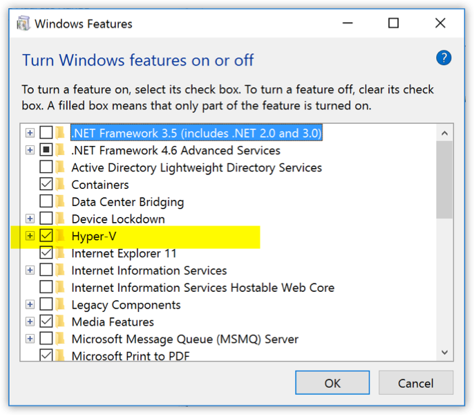
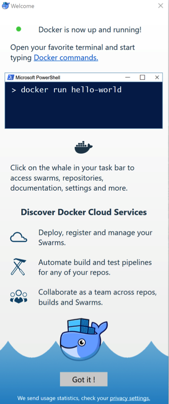
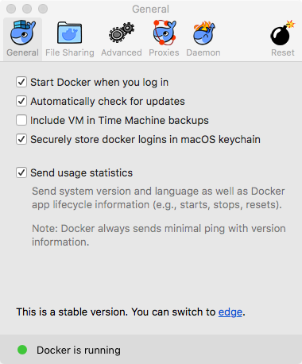
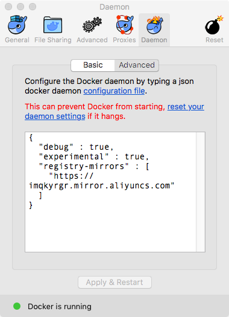

# 安装
其他平台上安装Docker都异常的简单，特别是Linux系统，几条命令就解决问题，本文重点会放在windows上的安装上。
Linux平台以ubuntu举例说明。

本文所说的Docker都是以[CE(Community Edition)](https://www.docker.com/community-edition)版本。
> Docker Community Edition (CE) is ideal for developers and small teams looking
> to get started with Docker and experimenting with container-based apps.

对于个人开发者与小团队来说，CE版本足够用来体验基于容器开发APP的过程。
[EE(Enterprise Edition)](https://www.docker.com/enterprise-edition)版本我没用过，也没有去看有啥功能。

# Ubuntu
[官方文档](https://docs.docker.com/engine/installation/linux/docker-ce/ubuntu/)很详细的说明了环境需求及安装过程，摘要如下。

### 系统要求
安装Docker，你需要使用以下发行版的64位版本
+ Zesty 17.04
+ Xenial 16.04 (LTS)
+ Trusty 14.04 (LTS)

Docker 支持x86_64、armhf与s390架构，s390仅仅在Ubuntu`Xenial`与`Zesty`中可用。

### 安装准备
```bash
# 1. 卸载旧版本
sudo apt-get remove docker docker-engine docker.io
# 2. 在14.04版本中，推荐使用`linux-image-extra-*包，使得Docker可以使用aufs存取驱动
sudo apt-get update
sudo apt-get install linux-image-extra-$(uname -r) linux-image-extra-virtual
```
### 指定Docker CE库
在一台新主机中需要指定Docker库地址，之后才能使用`apt-get`安装。
```bash
# 1. 更新apt包索引
sudo apt-get update
# 2. 安装https相关包
sudo apt-get install apt-transport-https ca-certificates curl software-properties-common
# 3. 添加官方GPG key
curl -fsSL https://download.docker.com/linux/ubuntu/gpg | sudo apt-key add -
# 3.1 验证fingerprint
sudo apt-key fingerprint 0EBFCD88
# 4. 指定稳定版Docker仓库，需要区分不同的架构
# 4.1 amd64
sudo add-apt-repository \
   "deb [arch=amd64] https://download.docker.com/linux/ubuntu \
   $(lsb_release -cs) \
   stable"
# 4.2 armhf
sudo add-apt-repository \
   "deb [arch=armhf] https://download.docker.com/linux/ubuntu \
   $(lsb_release -cs) \
   stable"
# 4.3 s390x
sudo add-apt-repository \
   "deb [arch=s390x] https://download.docker.com/linux/ubuntu \
   $(lsb_release -cs) \
   stable"
```
### 安装Docker
```bash
# 1. 更新apt索引
sudo apt-get update
# 2. 安装最新版Docker
sudo apt-get install docker-ce
# 安装指定版本：
# 2.1 获取可用版本列表
# apt-cache madison docker-ce
# 2.2 安装指定版本
# sudo apt-get install docker-ce=<VERSION>
# 3. 运行一个hello-word的镜像检测是否安装成功
sudo docker run hello-world
```

Linux大致过程如下，当然你也可以通过各种安装包(*.deb)来安装，详细说明不再列出，
请查阅[官方文档](https://docs.docker.com/engine/installation/linux/docker-ce/ubuntu/#install-from-a-package)
下面重点说下windows下安装(我喜欢windows环境~)

# Windows

在安装之前，首先确认你的windows版本以及硬件支持情况。

### 如果你的主机是：
+ 硬件支持Hyper-V，并且已经开启。
+ windows 10专业版或企业版64位版本。
+ 如果你的windows是虚拟机，Docker并不保证能正常运行。

特别说说`Hyper-V`。`Hyper-V`具体是什么我也说不清，只是大约知道是微软在系统内置的
虚拟化产品，有了这货Docker可以直接在其上建立隔离的容器环境而不必依赖于第三方虚拟工具，
比如`VirtualBox`，有兴趣的同学可以自己去查`Hyper-V`相关资料。

[在Windows 10上安装Hyper-V](https://docs.microsoft.com/zh-cn/virtualization/hyper-v-on-windows/quick-start/enable-hyper-v)
这是微软官方中文文档，请安照步骤完成。在某些系统中，开启`Hyper-V`可能还要去主板中设置参数。
在主板中的配置项一般称之为`Virtualization Technology (VTx)`或类似的名称。

如果你的主机不满足这写要求，请看跳过此段，进入[Docker Toolbox](#docker-toolbox)。不过我强烈建议
将硬件升级到满足上面的要求，只要不是老古董电脑，基本都是支持该功能的，你要做的可能只是升级到windows 10。

开启`Hypver-V`之后，可以在Windows Features面板中看到`Hypver-V`已勾上。



之后可以下载[Get Docker for Windows](https://docs.docker.com/docker-for-windows/install/#download-docker-for-windows)
这是一个exe安装文件，可直接运行，不必再折腾。

### Docker Toolbox
如果你的电脑不支持 Hypver-V，则需要使用 Docker Toolbox 来提供 Hypver-V 的功能。
此处其实我不太想将过多的时间花在 Docker Toolbox 上，因为实在没有必要。
此处就简单的从[文档](https://docs.docker.com/toolbox/overview/)上摘取一些内容说明。

Docker Toolbox是为旧的Mac和Windows系统提供Docker需要的环境的一体解决方案。
此处我再次强烈建议诸位升级系统，做开发的，吃饭的家伙可以多投入一点。
Docker Toolbox也是一个有界面的安装包，点几下就安装完成了。它提供了Docker所需的工具：

+ 运行`docker-machine`命令的 Docker Machine
+ 运行`docker`命令的 Docker Engine
+ 运行`docker-compose`的命令的 Docker Compose
+ Docker GUI工具: Kitematic
+ 一个提供Docker命令行的shell工具
+ Oracle VirtualBox，这个大家相当熟了，不用介绍了

安装过程就是不停的点击，我并没有试过Docker Toolbox，所以此处不作更详细的说明了，
如有需要，请查阅[官方文档](https://docs.docker.com/toolbox/overview/)

## 启动
windows和mac的docker都是有gui的。
### Windows


### Mac


不得不说，这LOGO真萌！

## 配置镜像代理
安装完Docker后必然要用到各种镜像，镜像都是从远程服务器[hub.docker.com](https://hub.docker.com/)下载的。
众所周知，国内的网络环境问题...
所以下载完之后，建议你立马去找一个Docker镜像国内镜像，网上应该能搜出不少吧...比如我用的是阿里云的。



下一篇解释Docker中的一些概念。


