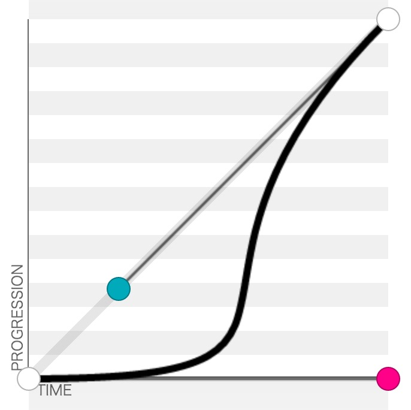

## SVG <animation/> calculation
默认情况下，一个简单的线性插值会展现出所有的values(from\to\by来决定)，
将这些值均匀的分布到动画的持续时间上。添加一些属性,可以在展现过程中更精细的控制这些值。
`calcModel` 属性定义了应用这些值的方法。
`keyTimes` 属性提供了额外控制动画时间的函数，将时间和 values 的值一一对应。
最后`keySplines`属性提供了一种控制 values 展现节奏的方法。

### calcMode
指定动画展现方式,默认值为 `linear`,可以取下列中的任意值。
如果该属性不支持线性插值,将会被忽略,此时将会使用 `discrete` 属性。

+ discrete
动画函数从一个值到下一个值时,不篡改任何值。
+ linear
在 values 之间简单的线性插值

+ paced
在动画执行期间产生相同的插值。该属性只支持值为线性取值范围的属性。
如果指定该值,则会忽略 `keyTimes` 和 `keySplines` 属性。

+ spline
从values列表中取下一个值，经三次方贝塞尔时间函数生成一个新值，然后插入。
这些点由 keyTimes 属性定义，在每个时间片内控制这些点由 keySplines 属性定义。

### values="list"
一个以分号分隔的列表。

### keyTimes="list"
一个以分号分隔的时间列用来控制动画的节奏。该列中的每一个值与 `values` 中的一一对应。
原定 `values` 中的值在动画中何时使用。`list` 中的值是一个介于 0-1 之间的浮点数。
表示在动画过程中偏移的比例。

如果一个动画定义了 `values` 属性,那么 `keyTimes` 属性的值的个数必须与 `values` 相等。
指定了 `from/to/by` 属性的动画, `keyTimes` 的值必须有两个。

**keyTimes** 语义依赖插值模型:
+ 线性和样条(linear and spline)动画,第一个值一定是`0`,最后一个值一定是`1`。
  如果设置了 `values`, `keyTimes` 的值和 `values` 的值关联。
  `values` 取 `keyTimes` 的值插值。
  (values are interpolated between the key times.)
+ 离散(discrete)动画,第一个值一定是`0`,如果设置了 `values`,动画时间将会与`values`的每个
  值关联。动画函数在`keyTimes`中定义的下一个时间点之前使用。
+ 如果插值模型为 `spaced`, `keyTimes` 将会被忽略。
+ 如果 `keyTimes` 中定义的值有错(错误的值、过多或过少),该文档碎片将会报错。
+ 如果持续时间为 `indefinite`, `keyTimes` 将会被忽略。

### keySpline="list"
一个根据`keyTimes`插值的 `Bézier` 控制点集合。
定义一个三次贝塞尔(cubic Bézier)曲线函数控制动画间隔节奏。
属性值为一个以分号分隔的描述控制点的集合。
每一个控制点的描述是一个四个值的集合: `x1 y1 x2 y2`。
用来描述一个时间片段的控制点。
> x1、y1、x2、y2 四个点在平面或在三维空间中定义了三次方贝兹曲线。
  曲线起始于x1走向y1，并从x2的方向来到y2。
  一般不会经过y1或x2；这两个点只是在那里提供方向资讯。
  x1和y1之间的间距，决定了曲线在转而趋进y2之前，走向x2方向的“长度有多长”。
  
http://www.w3.org/TR/SVG/animate.html#KeyTimesAttribute

Note:
+ 取值范围为 0 - 1。
+ 如果 `calcMode`的值不为 `spline`, 该属性将会被忽略。
+ 如果定义的值有错(错误的值、过多或过少),该文档碎片将会报错。
+ 该值必须比 `keyTimes` 少一个。

### from="values"
指定动画的开始值。

### to="values"
指定动画的结束值。

### by="value"
指定一个相对偏移量。

